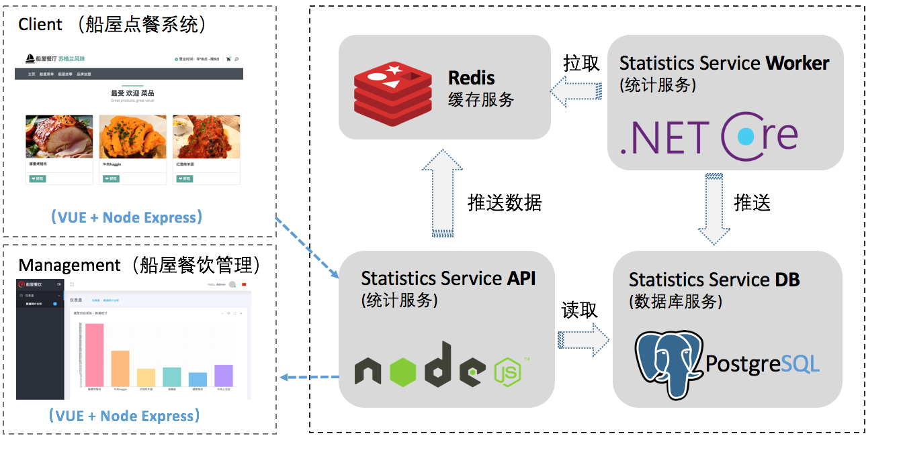
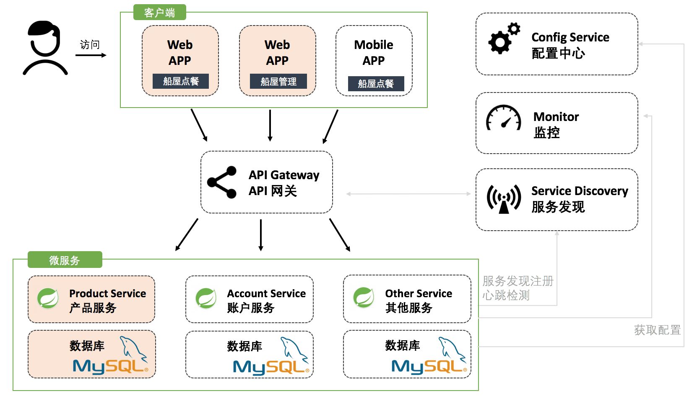

# Boat House（船屋餐饮系统）—— 服务端


+ [1. 架构设计](#1.%20架构设计)
    + [1.1. Statistics service 统计服务](#1.1.%20Statistics%20service%20统计服务)
    + [1.2. Product service 产品服务](#1.2.%20Product%20service%20产品服务)
    + [1.3. Account service 账户服务](#1.3.%20Account%20service%20账户服务)
    + 1.4. 订单服务（暂未实现，期待你的参与）
    + 1.5. 支付服务（暂未实现，期待你的参与）
+ [2. 本地环境配置](#2.%20本地环境配置)
+ [3. 本地开发调试](#3.%本地开发调试)
+ [4. DevOps](#4.%DevOps)
+ [5. 目录结构](#5.%目录结构)
+ 常见问题

 
## 1. 架构设计
船屋餐饮系统采用微服务架构设计，包含五条业务条线（统计服务、商品服务、账户服务、订单服务、支付服务），每一个业务条线可以独立的开发以及部署


| 服务  | 服务说明 | 技术架构 |
| ------------ | ------------ |------------ |
| product-service  | 业务条线 - 产品服务  |spring boot + mysql |
| account-service  | 业务条线 - 账户服务  |spring boot + mysql |
| order-service  | 业务条线 - 订单服务  |spring boot + mysql |
| payment-service  | 业务条线 - 支付服务  |spring boot + mysql |
| statistics-service  | 业务条线 - 统计服务  |.net core + redis + mysql |

### 1.1. Statistics service 统计服务

统计最受欢迎的菜品，并通过图表实时展示统计结果。




### 1.2. Product service 产品服务

进行菜品管理、菜品分类管理




### 1.3. Account service 账户服务

提供系统用户登录、用户管理的接口
TODO：放DEV环境的swagger链接

## 2. 本地环境配置

+ JDK

Java Development Kit (JDK), version 1.8. https://www.oracle.com/java/technologies/javase-jdk14-downloads.html

+ IntelliJ IDEA

https://www.jetbrains.com/idea/download/

> VS Code 参考：https://code.visualstudio.com/docs/java/java-spring-boot

## 3. 本地开发调试

- 以容器方式

本项目采用容器的方式进行编译、打包、以及运行，客户端安装Docker以及Docker-compose工具后可以一键运行此应用。

`
docker-compose -f src/docker-compose.yml up -d
`

- 在本机多应用联调

参考这个文档：[IDCF Boat House 快速开发指南](https://github.com/idcf-boat-house/boat-house/blob/master/docs/quick-start/operation/dev-guide.md)

## 4. DevOps

### DevOps 工具链

本项目使用JIRA进行项目管理、Github代码管理、Jenkins持续集成、Nexus进行包管理以及容器镜像管理、Jemeter进行接口测试以及压力测试、Selenium进行自动化UI测试。下图是本项目的持续交付流水线架构：


### ChatOps && AIOps

本项目将支持ChatOps && AIOps，让开发、测试、客户可以在IM即时通讯工具里以聊天的方式完成相应的工作。


## 5. 目录结构
``` tree
├── README.md
├── devops
│   ├── jenkins                                 # Jenkins File
│   ├── k8s-monitor 
│   └── kompose                                 # 测试、生产环境Docker Compose文件
├── images                                      # 当前文档库markdown文档引用图片统一存放的文件夹
├── src                                         # 资源文件
│   ├── Dockerfile                              
│   ├── account-service                         # 账号服务
│   ├── order-service                           # 订单服务
│   ├── pay-service                             # 支付服务
│   ├── product-service                         # 产品服务
│   ├── statistics-service                      # 统计服务
│   ├── docker-compose-template.yaml            # Dev环境Docker Compose文件
│   └── docker-compose.yml                      # 本地测试使用的Docker Compose文件
└── test                                        # 测试相关
    ├── jmeter  
    ├── junit
    ├── selenium
    └── unit-test
```

